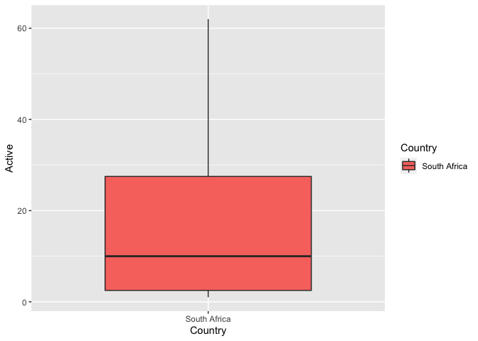
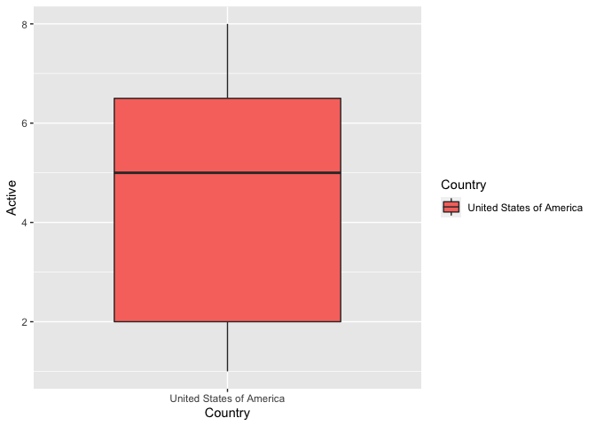
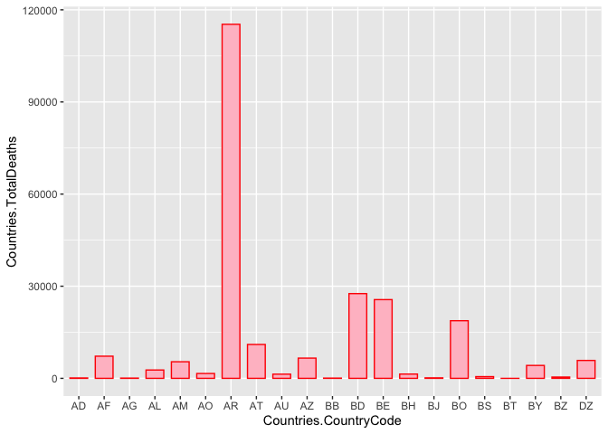
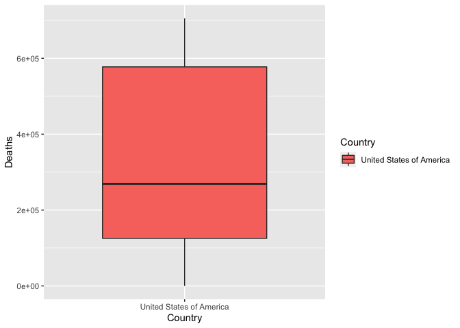
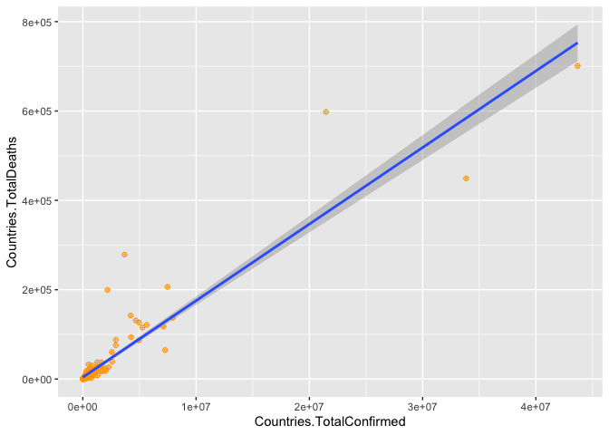

Project 1 558
================
Mary Brown
10/4/2021

# This code chunk connects to the COVID API and converts the summary information to text, then to json, and lastly to a data frame.

``` r
library(httr)  
library(jsonlite)  
Data<-GET("https://api.covid19api.com/summary")  
get_text<-(content(Data,"text"))  
get_json<-fromJSON(get_text, flatten=TRUE)  
get_df<-as.data.frame(get_json)  
```

# This function returns the number of cases of either confirmed cases, active cases, deaths, or recovered cases (user specified) for the United States

``` r
library(magrittr)  
library(dplyr)  
USAdata<-function(type="all"){  
  outputAPI<-GET("https://api.covid19api.com/total/country/united-states")  
  data<-fromJSON(rawToChar(outputAPI$content))
  if(type !="all"){  
    data<-data %>% select(type)
  }  
  return(data)
    }  
```

# This function returns user specified type by a user specified country in North America (united-states or canada)

``` r
NorthAmerica<-function(type="all", Country="all"){  
  outputAPI<-GET("https://api.covid19api.com/total/country/united-states")  
  data<-fromJSON(rawToChar(outputAPI$content))  
  if (type %in% c("Deaths", "Recovered", "Active", "Confirmed", "Date", "Country")){  
    if (Country == "canada"){  
      baseurl <- "https://api.covid19api.com/total/country/"  
      fullURL <- paste0(baseurl, Country)  
      data <- fromJSON(fullURL)  
      data <- data %>% select(type)  
    }  
    else if (Country == "united-states"){  
      baseurl <- "https://api.covid19api.com/total/country/"  
      fullURL <- paste0(baseurl, Country)  
      data <- fromJSON(fullURL)  
      data <- data %>% select(type)  
    }  
  }  
  else {  
    stop("Error: please specify either united-states or canada or a valid type")  
  }  
  return(data)  
}  
```

# Pull data from at least two endpoints

``` r
DataPull<-GET("https://api.covid19api.com/summary")  
DataPullText<-(content(DataPull, "text"))  
JSONdatapull<-fromJSON(DataPullText, flatten=TRUE)  
SummaryData<-as.data.frame(JSONdatapull)  

DataPull2<-GET("https://api.covid19api.com/total/country/south-africa")  
DataPullText2<-(content(DataPull2, "text"))  
JSONdatapull2<-fromJSON(DataPullText2, flatten=TRUE)  
TotalSouthAfricaData<-as.data.frame(JSONdatapull2)  

DataPull3<-GET("https://api.covid19api.com/total/dayone/country/united-states")  
Datapulltext3<-(content(DataPull3, "text"))  
JSONdatapull3<-fromJSON(Datapulltext3, flatten=TRUE)  
DayOneData<-as.data.frame(JSONdatapull3)
```

# You should create at least two new variables that are functions of the variables from a data set you use.

``` r
Summary1<-mutate(SummaryData, OldConfirmed = Global.TotalConfirmed-Global.NewConfirmed, OldDeaths = Global.TotalDeaths-Global.NewDeaths)  
```

# Create a few contingecy tables for comparison. The first one compares the Deaths in South Africa to the Deaths in the United States (since the first recorded case). The second table compares the confirmed cases in South Africa to the confirmed cases in the United States(since the first recorded case). The third table compares the amount recovered in south africa to the amount recovered in the united states(since the first recorded case).

``` r
Table1<-table(TotalSouthAfricaData$Deaths, DayOneData$Deaths)
Table2<-table(TotalSouthAfricaData$Confirmed, DayOneData$Confirmed)  
Table3<- table(TotalSouthAfricaData$Recovered, DayOneData$Recovered)
```

# Some numerical summaries for quantitative variables are shown here:

``` r
SummaryData %>% summarise(avg=mean(Countries.NewConfirmed), avg2=mean(Countries.TotalConfirmed), avg3=mean(Countries.NewDeaths), avg4=mean(Countries.TotalDeaths))  
```

    ##        avg    avg2     avg3     avg4
    ## 1 1581.312 1224292 23.77604 25031.05

``` r
SummaryData %>% summarise(med=median(Global.NewConfirmed), med2=median(Global.TotalConfirmed), med3=median(Global.NewDeaths), med4=median(Global.TotalDeaths))  
```

    ##      med      med2 med3    med4
    ## 1 303612 235063971 4565 4805962

``` r
SummaryData %>% summarise(sd1=sd(Countries.NewRecovered), sd2=sd(Countries.TotalRecovered), sd3=sd(Global.NewRecovered), sd4=sd(Global.TotalRecovered))  
```

    ##   sd1 sd2 sd3 sd4
    ## 1   0   0   0   0

# This first graph is a boxplot. I subsetted 21 rows and 21 columns from the summary data so that the information would look better in the boxplot. It made the data easier to read to make a smaller data frame out of the large one.

``` r
library(ggplot2)  
Chart<-GET("https://api.covid19api.com/total/dayone/country/south-africa")  
Chartt<-(content(Chart, "text"))  
Charttt<-fromJSON(Chartt, flatten=TRUE)  
SouthAfrica<-as.data.frame(Charttt)  
l<-SouthAfrica[c(1:12),c(1:12)]
d<-DayOneData[c(1:12),c(1:12)]  

p<-ggplot(l, aes(x=Country, y=Active)) +  
  geom_boxplot(width=0.7, aes(fill=Country)) 
print(p)  
```

<!-- -->

``` r
p2<-ggplot(d, aes(x=Country, y=Active)) + 
  geom_boxplot(width=0.7, aes(fill=Country))  
print(p2)
```

<!-- -->

# This second graph is

``` r
Graphdata<-SummaryData[c(1:21),c(1:21)]
g <- ggplot(data=Graphdata, aes(x = Countries.CountryCode, y = Countries.TotalDeaths)) +  
  geom_bar(stat = "identity", width=0.7, col = "red", fill = "pink") 
print(g)
```

<!-- -->

``` r
dd<-DayOneData[c(1:55),c(1:12)]
s<-ggplot(data=dd, aes(x=Recovered)) +  
  geom_histogram(binwidth=2, color="blue", fill="lightblue") +  
  geom_vline(aes(xintercept=mean(Recovered)),  
             color="black", linetype="dashed", size=1)
print(s)
```

<!-- -->

``` r
q<-ggplot(data = Summary1, aes(x = Countries.TotalConfirmed, y = Countries.TotalDeaths)) +  
  geom_point(shape=10, color="orange") + geom_smooth(method=lm)  
print(q)
```

    ## `geom_smooth()` using formula 'y ~ x'

<!-- -->
