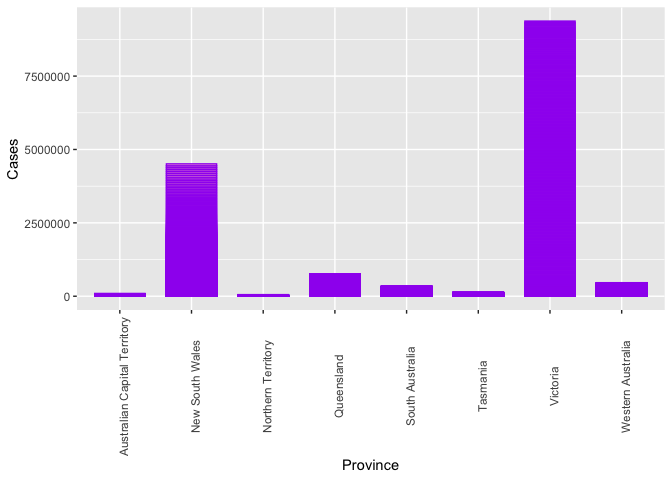
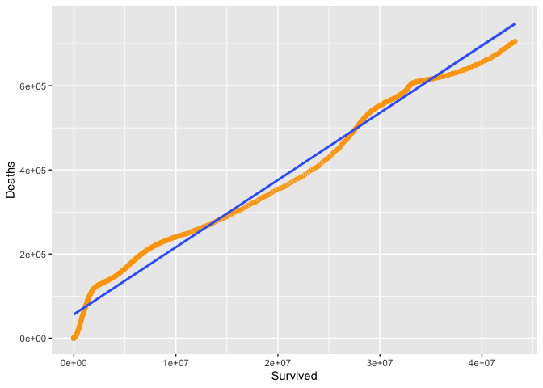

Project 1 558
================
Mary Brown
10/4/2021

## Required packages for this Project

-   Httr  
-   jsonlite  
-   ggplot2  
-   knitr  
-   dplyr
-   magrittr  
-   grid

## This helper function converts columns that contain numeric data stored as character values to numeric data types. I made this function first, in case I would need it moving forward.

``` r
convertToNumeric<-function(vec){  
  if(any(is.na(suppressWarnings(as.numeric(vec))) == TRUE)){  
    output <- vec  
  }  
  else{  
    output<-as.numeric(vec)  
  }  
  return(output)  
}  
```

## This code chunk connects to the COVID API and converts the summary information to text, then to json, and lastly to a data frame. This was just practice to make sure the correct data could be pulled.

``` r
library(httr)  
library(jsonlite)  
Data<-GET("https://api.covid19api.com/summary")  
get_text<-(content(Data,"text"))  
get_json<-fromJSON(get_text, flatten=TRUE)  
get_df<-as.data.frame(get_json)  
```

## This code chunk interacts with the countries endpoint of the COVID API.

``` r
CountriesEndpoint<-function(Country="all")  
  outputAPI<-fromJSON("https://api.covid19api.com/countries")  
  output<-outputAPI$content  
  if(Country %in% "Country")
  if (Country !="all"){  
  if (Country %in% output$Slug){  
    output<-output %>%  
      filter(Slug == Country)  
    }  
    else if (Country %>% output$ISO2){  
      output<-output %>%  
        filter(ISO2 == Country)  
    }  
    return(output)  
}  
```

## This function returns user specified type by a user specified country: either the United States or Canada

``` r
UnitedCanada<-function(type="all", Country="all"){  
  outputAPI<-GET("https://api.covid19api.com/total/country/united-states")  
  data<-fromJSON(rawToChar(outputAPI$content))  
  if (type %in% c("Deaths", "Recovered", "Active", "Confirmed", "Country")){  
    if (Country == "Canada"){  
      baseurl <- "https://api.covid19api.com/total/country/"  
      fullURL <- paste0(baseurl, Country)  
      data <- fromJSON(fullURL)  
      data <- data %>% select(type)  
    }  
    else if (Country == "United States"){  
      baseurl <- "https://api.covid19api.com/total/country/"  
      fullURL <- paste0(baseurl, Country)  
      data <- fromJSON(fullURL)  
      data <- data %>% select(type)  
    }  
  }  
  return(data)  
}  
```

## This function utilizes the Status endpoint for the COVID API. The data is for Australia with the status being user specified (Deaths, Confirmed, Recovered).

``` r
StatusEndpoint<-function(type="all", Country="Australia"){  
  outputAPI<-GET("https://api.covid19api.com/dayone/country/australia/status/confirmed/live")  
  data<-fromJSON(rawToChar(outputAPI$content))  
  if (type %in% "Status"){  
    if (type == "Deaths"){  
      baseurl <- "https://api.covid19api.com/dayone/country/australia/status/"  
      fullURL <- paste0(baseurl, deaths, "/live")  
      data<-fromJSON(fullURL)  
      data<- data %>% select(type)  
    }  
    if (type == "Confirmed"){  
      baseurl <- "https://api.covid19api.com/dayone/country/australia/status/"  
      fullURL <- paste0(baseurl, confirmed, "/live")  
      data<-fromJSON(fullURL)  
      data<-data %>% select(type)  
    }  
    if (type == "Recovered"){  
      baseurl <- "https://api.covid19api.com/dayone/country/australia/status/"  
      fullURL<-paste0(baseurl, recovered, "/live")  
      data <-fromJSON(fullURL)  
      data<-data %>% select(type)  
    }   
  }
    return(data)
}
```

## Pull data from at least two endpoints. For this section, I used the status endpoint function that I made and the USA/Canada function.

``` r
AustraliaConfirmed<-StatusEndpoint("Confirmed", "Australia")  
UnitedStatesConfirmed<- UnitedCanada("Confirmed", "United States")  
UnitedStatesDeaths<- UnitedCanada("Deaths", "United States")  
UnitedStatesRecovered<- UnitedCanada("Recovered", "United States")
CanadaConfirmed<- UnitedCanada("Confirmed", "Canada")  
CanadaDeaths<- UnitedCanada("Deaths", "Canada")  
CanadaRecovered<- UnitedCanada("Recovered", "Canada")  
UnitedStatesAll<-UnitedCanada("all", "United States")
```

## I created three new variables - the mean of cases in Australia, non-active cases for the United States, and the amount that have survived for the United States.

``` r
library(dplyr)
Summary1<-mutate(AustraliaConfirmed, Average=mean(Cases)) 
Summary2<-mutate(UnitedStatesAll, NonActiveCases=(Confirmed-Active))  
Summary3<-mutate(UnitedStatesAll, Survived=(Confirmed-Deaths))
```

## Create a few contingecy tables for comparison. The first contingency table looks at the Provinces in Australia, the second table looks at the dates for Australia and the Provinces for Australia. The third table looks at deaths in the United States. Contingency tables are useful for summarization of categorical variables - I don’t think I had the best data to work with here to make my contingency tables but an example of a 2-way contingency table would be table two.

``` r
Table1<-table(AustraliaConfirmed$Province)  
Table2<-table(AustraliaConfirmed$Date, AustraliaConfirmed$Province)
Table4<-table(AustraliaConfirmed$Country)
```

## Some numerical summaries for quantitative variables at each setting of some of the categorial variables. I utilized the mean and median as well as the group\_by and summarise functions.

``` r
Summary2 %>% group_by(Confirmed) %>% summarise(avg=mean(Confirmed), med=median(Confirmed))  
```

    ## # A tibble: 596 × 3
    ##    Confirmed   avg   med
    ##        <int> <dbl> <dbl>
    ##  1         1     1     1
    ##  2         2     2     2
    ##  3         5     5     5
    ##  4         6     6     6
    ##  5         8     8     8
    ##  6        11    11    11
    ##  7        12    12    12
    ##  8        13    13    13
    ##  9        14    14    14
    ## 10        16    16    16
    ## # … with 586 more rows

``` r
Summary2 %>% group_by(Deaths) %>% summarise(avg=mean(Deaths), med=median(Deaths))  
```

    ## # A tibble: 585 × 3
    ##    Deaths   avg   med
    ##     <int> <dbl> <dbl>
    ##  1      0     0     0
    ##  2      1     1     1
    ##  3      6     6     6
    ##  4      7     7     7
    ##  5     11    11    11
    ##  6     12    12    12
    ##  7     14    14    14
    ##  8     17    17    17
    ##  9     21    21    21
    ## 10     22    22    22
    ## # … with 575 more rows

``` r
Summary3 %>% group_by(Survived) %>% summarise(avg=mean(Survived), med=median(Survived))  
```

    ## # A tibble: 596 × 3
    ##    Survived   avg   med
    ##       <int> <dbl> <dbl>
    ##  1        1     1     1
    ##  2        2     2     2
    ##  3        5     5     5
    ##  4        6     6     6
    ##  5        8     8     8
    ##  6       11    11    11
    ##  7       12    12    12
    ##  8       13    13    13
    ##  9       14    14    14
    ## 10       16    16    16
    ## # … with 586 more rows

``` r
Summary3 %>% group_by(Active) %>% summarise(avg=mean(Active), med=median(Active)) 
```

    ## # A tibble: 594 × 3
    ##    Active   avg   med
    ##     <int> <dbl> <dbl>
    ##  1      1     1     1
    ##  2      2     2     2
    ##  3      5     5     5
    ##  4      6     6     6
    ##  5      8     8     8
    ##  6      9     9     9
    ##  7     10    10    10
    ##  8     11    11    11
    ##  9     12    12    12
    ## 10     17    17    17
    ## # … with 584 more rows

``` r
Summary3 %>% group_by(Recovered) %>% summarise(avg=mean(Recovered), med=median(Recovered))
```

    ## # A tibble: 278 × 3
    ##    Recovered   avg   med
    ##        <int> <dbl> <dbl>
    ##  1         0     0     0
    ##  2         3     3     3
    ##  3         5     5     5
    ##  4         6     6     6
    ##  5         7     7     7
    ##  6         8     8     8
    ##  7        12    12    12
    ##  8        17    17    17
    ##  9       105   105   105
    ## 10       121   121   121
    ## # … with 268 more rows

## This section shows a boxplot for the deaths in the United States. The line thrrough the boxplot marks the median which is the mid-point of the data. I utilized width and fill settings to make the graph look more presentable with such large data.

``` r
library(ggplot2)
p<-ggplot(Summary2, aes(x=Country, y=Deaths)) +  
  geom_boxplot(width=0.7, aes(fill=Country)) 
print(p)  
```

<!-- -->

## This second graph is barplot that explores the total cases by specific provinces in Australia. It’s interesting to see how many more cases are in specific provinces. I utilized stat, width, color, and fill for this plot. I also changed the angle of the x-axis labels to make them easier to read.

``` r
g <- ggplot(data=Summary1, aes(x = Province, y = Cases)) +  
  geom_bar(stat = "identity", width=0.7, col = "purple", fill = "pink") + theme(axis.text.x = element_text(angle=90)) 
print(g)
```

<!-- -->

## The below graph is a histogram showing the recovered cases for the United States. I added a mean line showing the average. The data frame for this was so large that I decided to subset it making a smaller data frame from rows 1:55 and columns 1:12.

``` r
RecovUS<-Summary3[c(1:55),c(1:12)]
s<-ggplot(data=RecovUS, aes(x=Recovered)) +  
  geom_histogram(binwidth=2, color="blue", fill="lightblue") +  
  geom_vline(aes(xintercept=mean(Recovered)),  
             color="black", linetype="dashed", size=1)
print(s)
```

<!-- -->

## The below graph is a scatterplot showing the survived cases vs deaths within the United States.

``` r
q<-ggplot(data = Summary3, aes(x = Survived, y = Deaths)) +  
  geom_point(shape=10, color="orange") + geom_smooth(method=lm)  
print(q)
```

    ## `geom_smooth()` using formula 'y ~ x'

<!-- --> \#\# The
below graph is a line plot showing the deaths vs confirmed cases in the
United States. Since the data set for this was so large, I decided to
subset it - making a smaller data frame of rows 1:55 and columns 1:12
(RecovUS)

``` r
library(grid)
ggplot(data=RecovUS, aes(x=Deaths, y=Confirmed, group=1)) +  
  geom_line(color = "orange", arrow=arrow()) + 
  geom_point()
```

<!-- -->
